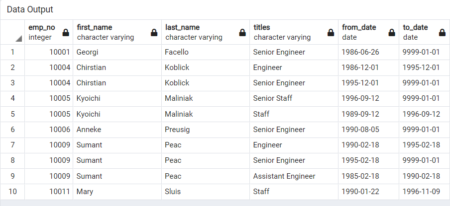
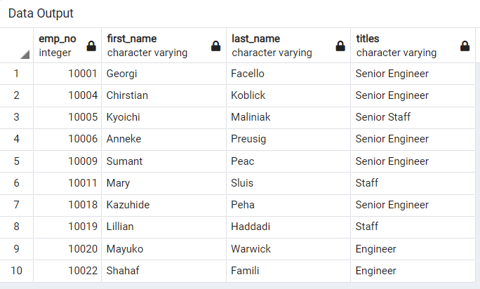
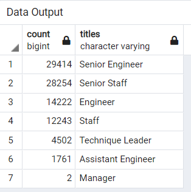
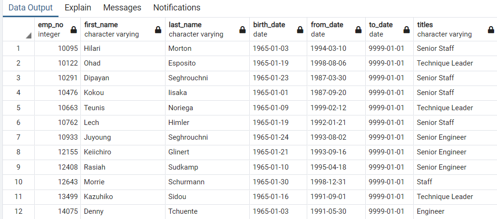
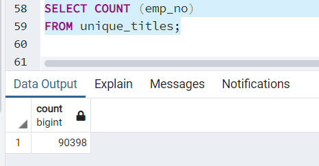
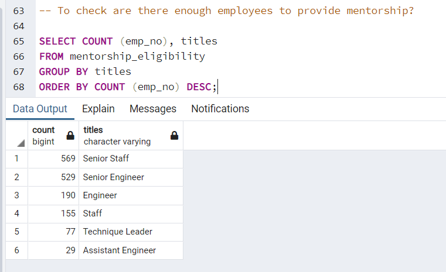

## **OVERVIEW OF THE ANALYSIS**
This data is about a huge organization where hundred of thousands of employees work. There are a large number of employees who are going to be retired soon and its important for the management to see and analyze this upcoming "Silver Tsunami".
In particular, the management want to see:

1- The number of retiring employees per title

2- To identify employees eligible to participate in a mentorship program

## **RESULTS**
The data has been analyzed considering the overall objective of the analysis. There are four main outcomes of this analysis which are as below:

1- A table showing titles wise employees who were born between 1952 and 1955 and are retiring. The snapshot of the table is below:

**Retirement Titles**

The total number of entries or employees as per this data is 133776 but there is one issue with this table that there are many duplicate entries where one employee got promoted over the time and his/her name appeared more than once with old and new title. So we did further filtering on the data.

2- Next table shows data from 1st table without duplicate entries meaning a single employee is mentioned only once with his/her latest title. This time we got the correct figure of these retiring employees. Their number is 90398. The snapshot of this table is below:

**Unique Titles**

3- Then we further filtered the data to show the title wise number of employees retiring and below is the complete table.

**Retiring Titles**

This table tells us that highest number of employees are retiring under the title of **Senior Engineer**. The sum of all these retiring employees is 90398 as earlier mentioned.

4- Next we analyzed the data to provide the details of the employees  who might be eligible for *Mentorship*. The criteria for this selection was the employees who were born in 1965 and they are still the employees of the firm. Again this data also contain the information of their titles. The snapshot of this table is below:

**Mentorship Eligibility**

## **SUMMARY**

There are couple of things which are answered by this analysis. 

**Q**- How many roles will need to be filled as the "silver tsunami" begins to make an impact?

**Ans**-Based on the analysis of the retiring employees who were born between 1952 and 1955, this "Silver Tsunami" will consist of following figures:

*Number of Roles/Titles of these retiring employees*: 7  (detail of per title retirees is given above in the figure"retiring_titles")

*Number of people retiring* : 90398. The snapshot of the code and the outcome is given below:

**No of Retiring Employees/Roles**

**Q**-Are there enough qualified, retirement-ready employees in the departments to mentor the next generation of Pewlett Hackard employees?

**Ans**- The total number of employees who are retiring are 90398 and employees eligible for Mentorship are 1549. Further analysis has been done under **each title** to see whether there are enough people in **Retirement Ready** list to provide mentorship in **Mentorship Eligibility** list and the result shows us that there are more than enough people under each title who are retiring and can give mentorship. Both the tables are shown below:

**Employees Eligible for Mentorship**
 

**Employees Ready for Retirement**

This is evident from these tables that there shouldn't be any shortage of people who can provide mentorship e.g there are 190 Engineers eligible for mentorship and 14222 Engineers are getting retired so these retirees can provide mentorship to eligible engineers.